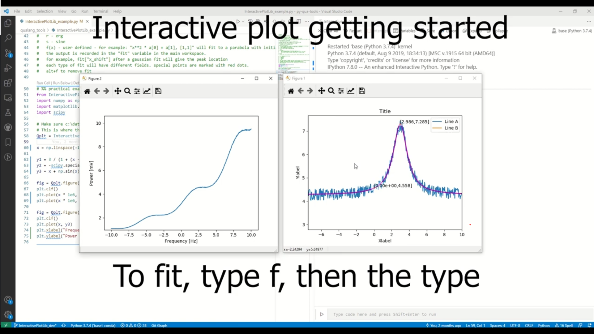

# Introduction
This package includes tools which are more generic and not necessarily related to QUA.
Some of these tools are experimental and are not fully supported and tested, but we believe have a true product value.

## InteractivePlotLib
This package drastically extends the capabilities of matplotlib, enables easily editing various parts of the figure, 
copy-pasting data between figures and into spreadsheets, fitting the data and saving the figures.

To use, you need to install the package using `pip instal qualang_tools[interplot]`

> **_Note:_** It is currently experimental and only supports win32 with IPython.

## Example

[](https://www.youtube.com/watch?v=LaaNTySw1fY "Example Video")
[](https://www.youtube.com/watch?v=bC409aeA8p4 "Example Video part 2")

```python
from qualang_tools.addons.InteractivePlotLib import InteractivePlotLib 
import numpy as np
import matplotlib.pyplot as plt
from scipy.special import erf

# Make sure c:\data exists, you can specify any other empty directory.
# This is where the data will be stored.
Qplt = InteractivePlotLib("c:\data")

x = np.linspace(-10, 10, 501)

y1 = 3 / (1 + (x - 3)**2) + 0.5 * np.random.rand(len(x)) + 4
y2 = -erf(x) + np.random.rand(len(x)) * 0.1 + 4
y3 = x + np.sin(x) - 40 + np.random.rand(len(x)) * 0.1

Qplt.figure(1)
plt.clf()
plt.plot(x * 1e6, y1)
plt.plot(x * 1e6, y2)

Qplt.figure(2)
plt.clf()
plt.plot(x, y3)
plt.xlabel("Frequency [Hz]")
plt.ylabel("Power [dBm]")
```
## Support
- Plot
- Hist2d
- Pcolor
- PcolorMesh

## Commands
- Click on title area - write the title
- Click on xlabel area - write xlabel
  - Write command using the ":" symbol
    - ":lin" for linear scale, ":log" for log scale
    - ":f(x)" (for example ":2*x", "x**2") to scale the data by a function.
    - ":u" - change units. For example, for the label x[V], click then write :u, then x[mV] to change the scale
- Click on ylabel area - write ylabel
  - Write command using the ":" symbol
    - Same commands as xlabel. use ":f(y)" for function scaling.
- Click near the edge of axes (near the numbers) to set a limit xlim or ylim
- Click outside the canvas on the right side to set a legend.
- Use up/down arrows to move between curves
- Click on a curve to select it
  - Copy - when selected, ctrl-c to copy it. you can paste it to another figure or excel/notepad
    - Can also copy-paste from excel to a figure, need x,y coordinates.
  - C - color, change color to r,g,b,m,k etc
  - Up/down - shift the order of curves in the figure
  - 1...9 - click on a number to change line width
  - Delete
- s - Save data.
  - Will save the open figures in the directory specified. Try it!
  - You can load the data later by: out = Qplt.load(n) where n is the "scan number"
    - This will load the data into the workspace, and out["code"] is the code you used.
- g - grid.
- m - Marker mode - Click any point on a curve or point.
  - Shift+m to add a new marker.
  - Alt+m to clear all markers
- f - fit (only on the visible range):
  - 0..9 - Polynomial fit.
  - g - Gaussian
  - l - Lorenzian
  - e - Exponent
  - r - Erg
  - s - Sine
  - S - Sine * exp
  - f(x) - User defined - For example: "x**2 * a[0] + a[1], [1,1]" will fit to a parabola with initial gauss for a: [1,1]
  - The output is recorded in the "fit" variable in the main workspace.
  - For example, fit["x_shift"] after a gaussian fit will give the peak location
  - Each type of fit will have different fields. Special points are marked with red dots.
  - Alt+f to remove fit
- l - convert 2d plot to 1d plot lines
- p - convert lines to pcolor
- r - rectange - define a rectange to interact with the figure - to delete/copy only inside the rectangle
- t - transpose - transpose data in 1d\2d plot
- v - voronoi - define centers of voronoi and count population in each cell
