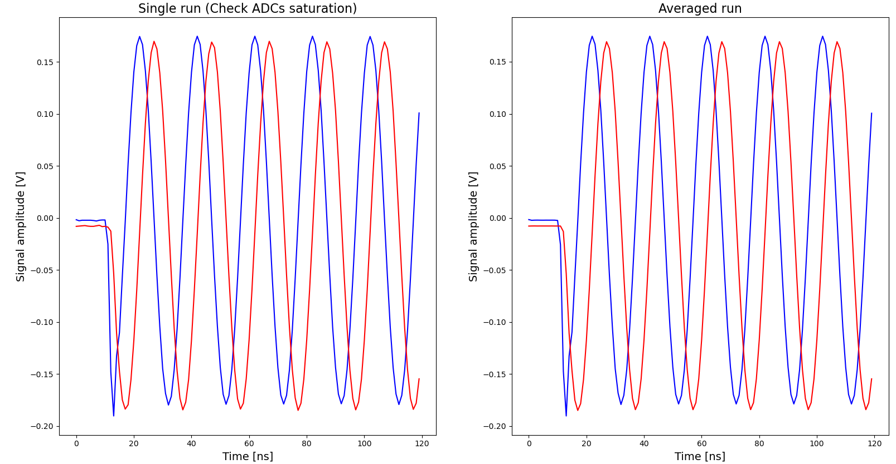
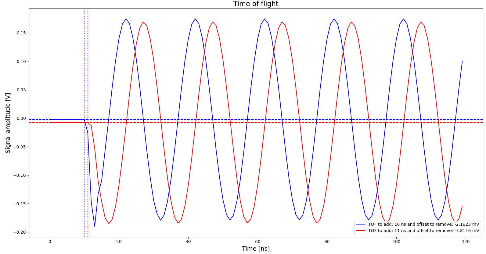
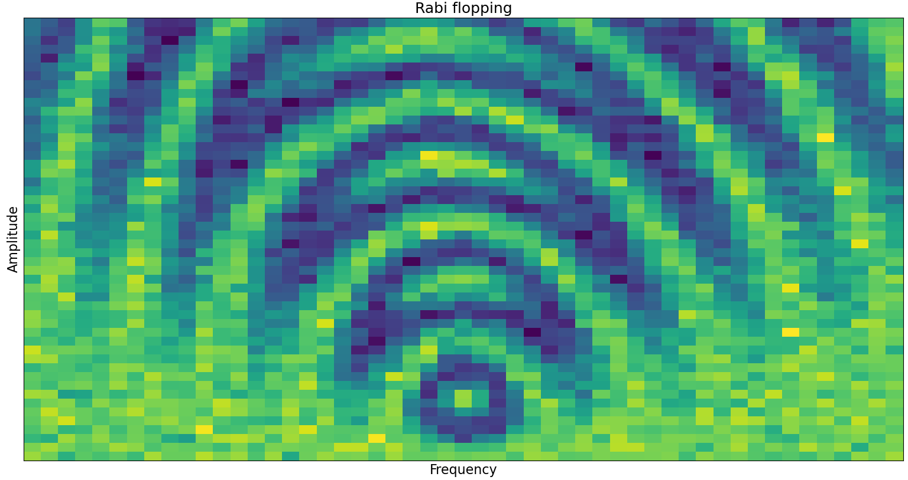
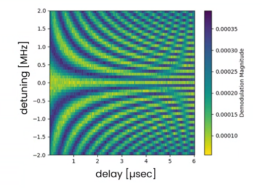

# Calibration API

## Introduction

This module allows to easily perform most of the standard single qubit calibrations from a single python file.

The following calibrations are currently available:
* [raw_traces](#raw-traces): acquires the raw and averaged traces from the two inputs of the OPX.
* [time_of_flight](#time-of-flight): measures the time of flight and offsets of the two inputs of the OPX.
* [resonator_spectroscopy](#resonator-spectroscopy): performs a resonator spectroscopy.
* [Rabi](#rabi-measurement): performs a Rabi experiment where the pulse amplitude, duration and frequency can be scanned.
* [T1](#t1-measurement): measures the qubit T1 by scanning the time after the application of a $\pi/2$ pulse.
* [Ramsey](#ramsey-measurement): performs a Ramsey measurement where the idle time and pulse frequency can be scanned.

## Usage Example
1. First the user needs to specify the relevant configuration parameters that will be used for the calibrations:
the _qubit_ and _readout-resonator_ elements and operations, the _integration weights_ and OPX inputs (defined as elements outputs).
An optional _flux_line_ element and operation can be specified in the case of flux tunable transmon to find the flus soft spot with the resonator spectroscopy.
Several options are also available for customizing the plots. All of them are written in the snippet below.

2. Then the calibration API is initialized with these parameters. A matching configuration also needs to be provided.
3. The sequence of calibrations needs to be set using the `.set_` method. All the available calibrations and setting methods are detailed in the *Available calibrations* section below. Note that several calibrations can be set and executed sequentially, but currently the same calibration cannot be executed twice in a row.
4. A quantum machines manager needs to be opened with the correct IP address.
5. The calibration can be simulated to check the validity of the sequences. This will plot the analog and digital pulses played during the sequences.
6. After opening a quantum machine with the configuration, the calibrations can be executed. The flag called `plot` can be take three values:
   * "full" to plot the results at the end of the sequence.
   * "live" to plot the results while the sequence is being executed.
   * None which will not plot anything.
7. The results are stored in a dictionary accessible under `my_calib.results`.


```python
from qm import QuantumMachinesManager
from qualang_tools.addons.calibration.calibrations import *
from configuration import * 

# Relevant configuration parameters
#############################################################
resonator_element = "resonator" # (required)
resonator_operation = "readout" # (required)
qubit_element = "qubit"         # (required)
qubit_operation = "cw"          # (required)
flux_line_element = None        # (optional)
flux_line_operation = None      # (optional)
int_w = ["cos", "sin", "minus_sin", "cos"]  # (required)
outs = ["out1", "out2"]                     # (required)
# Options for plotting figures  # (optional) 
options = {
    "fontsize": 14,
    "color": "b",
    "marker": ".",
    "linewidth": 1,
    "figsize": (12, 15),
}
#############################################################

# Initialize the calibration API with the relevant configuration parameters
my_calib = QUA_calibrations(
    configuration=config,
    readout=(resonator_element, resonator_operation),
    qubit=(qubit_element, qubit_operation),
    integration_weights=int_w,
    outputs=outs,
)

# Set calibrations from the ones detailed below
my_calib.set_...

# Open quantum machines manager
qmm = QuantumMachinesManager(host="127.0.0.1", port=80)

# Simulate the calibrations
my_calib.simulate_calibrations(qmm, simulation_duration=5000)

# Run the calibrations
qm = qmm.open_qm(config)
my_calib.run_calibrations(quantum_machine=qm, plot="full", plot_options=options)
```

## Available calibrations
### Raw traces
This program acquires the raw and averaged traces from the two inputs of the OPX.
It only requires two inputs:
* `iterations`: number of averaging iterations. Must be a positive Python integer.
* `cooldown_time`: wait time between two iterations in clock cycle unit (4ns). Must be an integer.
```python
my_calib.set_raw_traces(iterations=1000, cooldown_time=0)
```


### Time of flight
This program measures the time of flight and offsets of the two inputs of the OPX.
It requires three inputs:
* `iterations`: number of averaging iterations. Must be a positive Python integer.
* `cooldown_time`: wait time between two iterations in clock cycle unit (4ns). Must be an integer.
* `threshold`: detection threshold for time of flight estimation. The default value is 10/4096 V/ns which is usually good enough to detect the waveform.
```python
my_calib.set_time_of_flight(iterations=1000, cooldown_time=0, threshold=10/4096)
```


### Resonator spectroscopy
This program measures the resonator response for different readout pulse frequencies defined in scan_variables.
It requires three inputs:
* `scan_variables`: variables to be scanned. Must be an array of tuples [('variable', [values])]. 1D and 2D scans are available and the scanning parameters are:
  * 'frequency': readout pulse frequency in Hz, must be an integer.
  * 'amplitude': flux pulse amplitude as a pre-factor to the amplitude set in the configuration, must be in [-2,2).
* `iterations`: number of averaging iterations. Must be a positive Python integer.
* `cooldown_time`: resonator cooldown time in clock cycles (4ns). Must be an integer.

```python
scans = [("frequency", np.arange(100e6, 300e6, step=0.1e6))]
my_calib.set_resonator_spectroscopy(scan_variables=scans, iterations=1000, cooldown_time=10_000//4)
```

### Rabi measurement
This program performs a Rabi-like measurement by sending a pulse to the qubit and measuring the resonator response.

It requires three inputs:
* `scan_variables`: variables to be scanned. Must be an array of tuples [('variable', [values])]. 1D and 2D scans are available and the scanning parameters are:
  * 'duration': pulse length in clock cycles (4ns), must be an integer. If the waveform is arbitrary, the scanned duration must be greater than the one defined in the configuration (arbitrary waveforms can only be stretched and not compressed on the fly).
  * 'frequency': pulse frequency in Hz, must be an integer.
  * 'amplitude': pulse amplitude as a pre-factor to the amplitude set in the configuration, must be in [-2,2).
* `iterations`: number of averaging iterations. Must be a positive Python integer.
* `cooldown_time`: qubit cooldown time in clock cycles (4ns). Must be an integer.


```python
scans = [
    ("duration", np.arange(16, 4000, step=100)),
    ("amplitude", np.linspace(0.5, 1.99, num=51)),
]
my_calib.set_rabi(scan_variables=scans, iterations=100, cooldown_time=0)
```


### T1 measurement
This program performs a T1 measurement by sending a $\pi$-pulse to the qubit and measuring the resonator response after a varying time.

It requires three inputs:
* `scan_variables`: variables to be scanned. Must be an array of tuples [('variable', [values])]. The available scanning parameter is:
  * 'duration': wait time in clock cycles (4ns), must be an integer.
* `iterations`: number of averaging iterations. Must be a positive Python integer.
* `cooldown_time`: qubit cooldown time in clock cycles (4ns). Must be an integer.

```python
scans = [
    ("duration", np.arange(5, 4000, step=10)),
]
my_calib.set_rabi(scan_variables=scans, iterations=100, cooldown_time=0)
```

### Ramsey measurement
This program performs a a Ramsey-like measurement ($\pi/2$ - idle time - $\pi/2$).

It requires three inputs:
* `scan_variables`: variables to be scanned. Must be an array of tuples [('variable', [values])]. 1D and 2D scans are available and the scanning parameters are:
  * 'duration': idle time in clock cycles (4ns), must be an integer. If the waveform is arbitrary, the scanned duration must be greater than the one defined in the configuration (arbitrary waveforms can only be stretched and not compressed on the fly).
  * 'frequency': pulse frequency in Hz, must be an integer.
* `iterations`: number of averaging iterations. Must be a positive Python integer.
* `cooldown_time`: qubit cooldown time in clock cycles (4ns). Must be an integer.

```python
scans = [
    ("duration", np.linspace(4, 4000, num=101)),
    ("frequency", np.linspace(100e6, 200e6, num=101)),
]
my_calib.set_ramsey(scan_variables=scans, iterations=100, cooldown_time=0)
```
