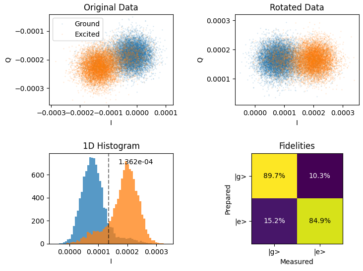

# Analysis Tools
This library includes tool for analyzing data from experiments. 

## Discriminator

The discriminator has a tool for discriminating between two states in the IQ plane.

### Usage Example

```python
from qualang_tools.analysis.discriminator import two_state_discriminator

# Run an IQ blob experiment.

angle, threshold, fidelity, gg, ge, eg, ee = two_state_discriminator(Ig, Qg, Ie, Qe, b_print=True, b_plot=True)
```

In addition to the returned variables, the following plot would be created:


*Data taken at HQC Lab in EPFL

For a more complete example, please see the example in the [QUA Library GitHub](https://github.com/qua-platform/qua-libs/blob/main/Quantum-Control-Applications/Superconducting/Single%20Fixed%20Transmon/IQ_blobs.py)