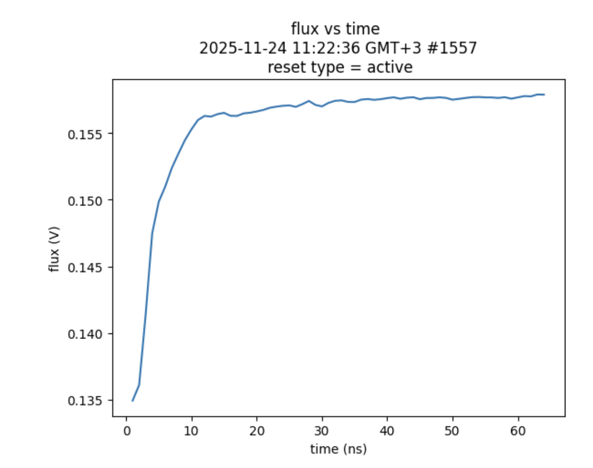
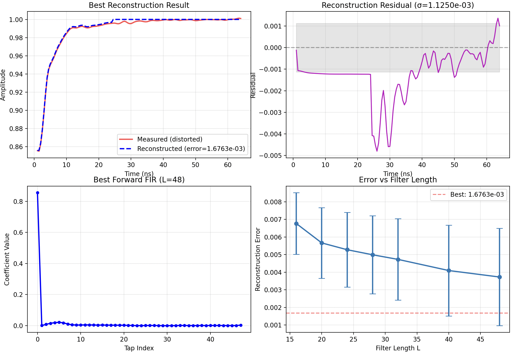
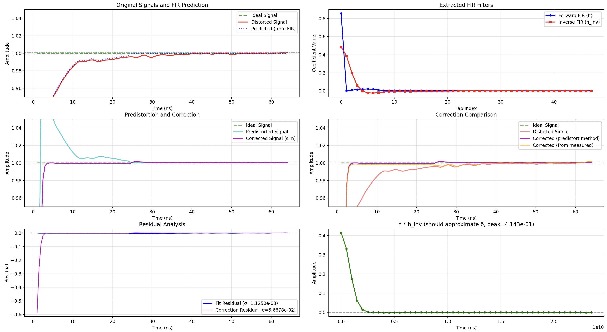
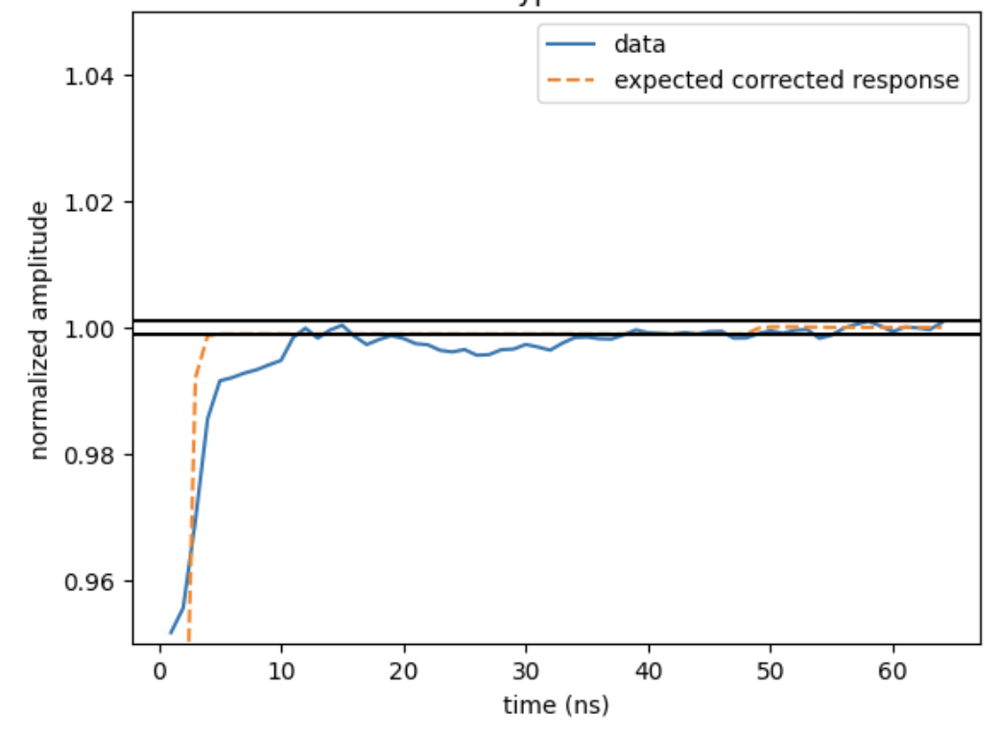
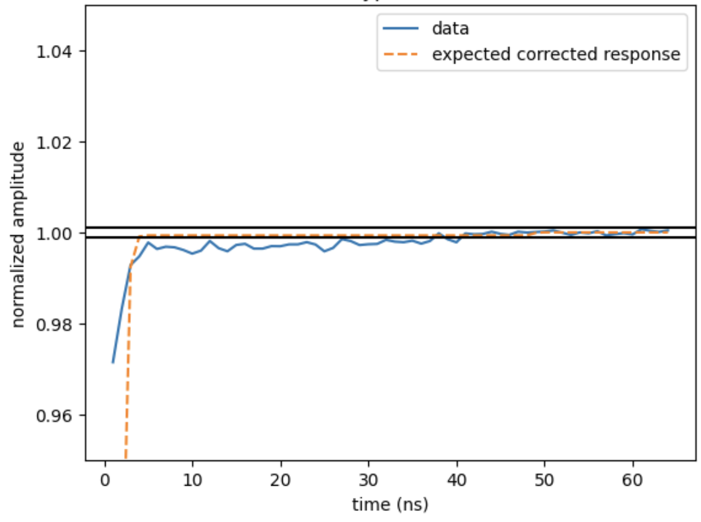

# Digital filter correction fitting functions

## Overview of digital filters

When operating qubits and aiming for high-fidelity single- and two-qubit gates, performance is often limited by the quality of the control pulses generated by the room-temperature controller. Distortions are introduced by the analog setup that connects the controller to the qubits. For example, due to impedance mismatches in the transmission lines. Two main types of filters are typically required:

 - Short timescale distortions ($\lesssim$ 30 ns): These appear as fast, unwanted variations in the control signal. Such deviations can be corrected using FIR (finite impulse response) filters.
 - Long timescale distortions ($\gtrsim$ 30 ns): These manifest as additional RC-like filtering of the signal, leading to long saturation times. Such distortions can be corrected using IIR (infinite impulse response) filters.

This file provides tools for calculating the correction parameters needed to implement digital filters with the OPX1000. In particular, it focuses on generating the IIR filter coefficients that can be directly inserted into the OPX1000 configuration file, making it seamless to implement high-fidelity gates.

More background on digital filters can be found in the [QUA documentation page](https://docs.quantum-machines.co/latest/docs/Guides/output_filter).

## FIR correction filter functions

This repository is optimized for estimating FIR filter corrections and it is optimized to work once IIR corrections have already been extracted. The following FIR implemetnation is based on the procedure described in this [paper](https://arxiv.org/abs/2503.04610).

The FIR filters works at 2 GSa/s, and there are 48 taps availbale per core, therefoe allowing corrections for the first 24 ns. \
First, we extract the forward FIR filter that, when convolved with an ideal step, best reproduces the measured response; this is done by solving a regularized least-squares problem that balances reconstruction accuracy with smooth, physically plausible coefficients. A Toeplitz convolution matrix is used to express the convolution. Noise overfitting is prevetned by implementing a Tikhonov regulizer while a second regulizer is used to physically model that the filter deos not extend indefinitely.\
The best combination of FIR length and regularization parameters is selected by minimizing the reconstruction error across candidate models. \
After the forward FIR is found, a second optimization computes an inverse FIR filter that, when applied before the hardware response, compensates distortions by approximating a delta function. A Gaussian target and a smoothness regularizer make this inversion stable.

The workflow assumes that distorted pulse data have already been measured at the qubit level and corrected for IIR distorsions. After that data should be saved in a ```.h5``` (NetCDF) file.

### Features
1. Forward FIR system identification
    - Fits a finite-impulse-response (FIR) filter that transforms an ideal step into the measured step response using regularized least-squares.
    - Uses multiple regularization coefficients to suppress noise amplifications.
    - Automatically optimizes FIR lengths and regularizations parameters.
2. Inverse FIR filters extraction - the predistorsion filters
    - Computes a second FIR filter whose convolution with the forward filter approximates a delta function.
    - Uses a Gaussian target as surrogate for the ideal delta and a smoothness regularizer to avoid unstable solutions from the inversion procedure

### Workflow
1. Import data in ```.h5``` (NetCDF) file. Remeber to correct the data for IIR distorsion before first.
2. Set the ```FIR_filters_coefficitents```: Tikhonow regularization parameters ```lam1_values```, exponential decay regularization parameters ```lam2_values``` as well as the number of FIR coefficients ```L```. These coefficients try to model the setup transfer function. Since this can be complicated, the algorithm evaluates many possible FIR filters and chooses the one that best explains the measured data. 
3. Run the optimization ```analyze_and_plot_fir_fit``` (this is automatically called in the main function). For each parameter combination, the function reconstructs the step response and chooses the combination that gives the best fit. The function plots the measured vs reconstructed step response and prints the residuals as well as the stability of the FIR coefficients. If the fit is smooth an residual are small, continue to next step. If results are inconsisitend, manually optimize the FIR filter coefficients.
4. Now set the ```inverse_FIR_filter_coefficients```: the ```method``` to use for inversion of the previusly calculated transfer function (default is ```optimization```), the ```sigma_ns``` which defines the width of the Gaussian which approximates the delta function resulting from the inversion (typically 0.5ns or 0.25ns is used) and eventually ```lam_smooth``` is the regularization parameter used to limit rapid changes in the inverse FIR coefficients. Smaller values of ```sigma_ns``` and ```lam_smooth``` produce more aggressive correction at the cost of noise amplification and possible instabilities. Values in the range ```sigma_ns``` = 0.25-0.75ns and ```lam_smooth``` = 0.01 - 0.1 should suffice but the user can explore other possibilities based on the data at hand.
5. Run the optimization ```analyze_and_plot_inverse_fir```, which for each combination of ```inverse_FIR_filter_coefficients``` it solves the inverse step response. The function plots the measured vs reconstructed step response and displays the residuals along with the stability of the FIR coefficients. If the reconstruction is smooth, residuals are small, and the predistortion looks physically reasonable, the FIR fit is considered valid and you can proceed. If the results are inconsistent, manually adjust the ```inverse_FIR_filter_coefficients``` and rerun the analysis.
6. The list of ```fir_filter``` can now be copied and pasted directly in the configuration file in the ```filter``` -> ```feedforward``` section.
7. Watch the magic unfold and boost your gate fidelity even more!

### Example

Below is an example of implementing the FIR digital filter using the OPX1000 to correct distortions in a flux-tunable superconducting qubit.

The original uncorrected control pulse was obtained through the [cryoscope experiment](https://pubs.aip.org/aip/apl/article/116/5/054001/38884/Time-domain-characterization-and-correction-of-on), where the LF-FEM channel of the OPX1000 was used to control the qubit flux response. Here the corresponding [QUA implementation](https://github.com/qua-platform/qua-libs/blob/main/Quantum-Control-Applications/Superconducting/Single-Flux-Tunable-Transmon/17_cryoscope_1ns.py). Because the flux pulse is distorted by the dilution refrigerator transmission lines, the qubit exhibits a quantum state response directly dependent on the pulse distortion. From this, the actual pulse shape at the qubit can be reconstructed.

As the data are saved in the ```.h5``` file, we can now follow the workflow introduced above:
````python
import numpy as np
import netCDF4 as nc

# load data
with nc.Dataset('path_to_dataset.h5', 'r') as f:
    t_data = np.array(f.variables['time'][:])
    y_data = np.squeeze(np.array(f.variables['flux_response'][:]))

# normalize the response and resample the response to 2 GS/s
normalized_response_raw = y_data / y_data[-10:].mean()
original_Ts = t_data[1] - t_data[0]
normalized_response_2gsps = resample_to_target_rate(normalized_response_raw, original_Ts, 0.5)
time_2gsps = np.arange(len(normalized_response_2gsps)) * 0.5 + 1

#define the coefficients
FIR_filter_coefficient = [[16, 20, 24, 28, 32, 40, 48],[1e-5, 1e-4, 1e-3, 1e-2, 1e-1],[1e-5, 1e-4, 1e-3, 1e-2, 1e-1]]
inverse_FIR_filter_coefficient =[0.75,5e-2,'optimization' ]

# fit the data and plot the forward and inverse FIR filters
h_fir, inv_fir, fig_fir_fit, fig_inv_fir_fit = analyze_and_plot_inverse_fir(
    response=normalized_response_2gsps,
    time=time_2gsps
    )

# calculate the predistorted and corrected response
ideal_response = np.ones(len(y_data))
predistorted_response = lfilter(inv_fir, 1, ideal_response)
corrected_response = lfilter(h_fir, 1, predistorted_response)

# feedforward filters to be used in config file
fir_filter = inv_fir.tolist() 

# Assuming that we want to update the filters on analog output port 1 of LF-fem 1
output_port = config["controllers"]["con1"]["fems"][1]["analog_outputs"][1]
output_port["filter"] = {
   "exponential_dc_gain": a_dc,
   "exponential": exponential_filter,
   "feedforward": fir_filter
}


````
On a given qubit, after the IIR filter function has been applied, we would obtain a step response at the qubit that will look like the following one



By selecting the ```FIR_filters_coefficitents``` = [[16, 20, 24, 28, 32, 40, 48],[1e-5, 1e-4, 1e-3, 1e-2, 1e-1],[1e-5, 1e-4, 1e-3, 1e-2, 1e-1]] (where the coefficients are lists so that the algorithm can iterate over multiple configurations), the result of the calculated hardware setup transfer function will look like the follwoing plot:



The upper panels show the reconstructed and measured normalized step response of Fig. 1 (left panel) and the correpsonding difference (right panel). The bottom right panel shows the mean and standard deviation of the rms reconstruction error for each number of FIR coefficients, with the lowest error in red horizontal dashed line. The best FIR coefficients are shown on the bottom left panel. This fit is succesful with BEST PARAMETERS =[L = 48, lam1 = 1e-03, lam2 = 1e-04] and a reconstruction error of 1.6763e-03 (0.17%). 

We can now move forward and define the ```inverse_FIR_filter_coefficients``` = [0.75,5e-2,'optimization' ] and proceed to extract the inverse of the hardware setup response which will be used in the FIR filters coefficients in the OPX100 configuration file. For these coefficients, we obtain the following results:



The upper left panel shows the measured and reconstructed signal based on the forward FIR extraction (similar to the upper left panel of Fig. 3), and upper right panel shows the extracted forward and inverse FIR coefficients. The middle left panel shows the predistorted signal and the expected corrected signal, and the middle right panel shows also the measured signal and the backward corrected signal (calculated from the measured signal and the inverse FIR filter). The lower panels show the difference between the corrected signal and the ideal step function (left) and the convolution of the forward and inverse FIR filters, that should be close to the target Gaussian approximating a delta function. The obtained correction error in the is 5.713e-02 and therefore acceptable.

The FIR filter coeffieicent are now saved in the configuration file. By now performing a new cryoscope experimetn (where the predistorted pulse is played), we obtain the following mesaured step response at the qubit (in blue)



One can perform the FIR filter estimation again, whihc would convolute the existing filters and the new extracted ones. Such iterations can be repeated until no more improvement is observed. We eventually achieved the following result



Showing an effective rise time of <1 ns (as the first point of 1ns is set at 0.97) as well as a clear saturation within 0.1% of the signal within 5 ns. In both figures, the black solid lines represent 0.01% of the target step impulse (normalized to 1).
