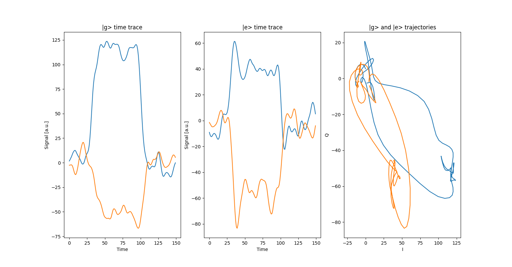

# Readout optimal integration weights

In the dispersive readout of a superconducting qubit, a microwave pulse is sent to the readout
resonator and the reflected or transmitted signal is captured and analyzed to infer the 
state of the qubit.

The steps to capture the state of the qubit are: (i) capture the analog signal coming out of the resonator,
(ii) demodulation of the analog signal, and (iii) the integration of the demodulated signal. 

The integration step can be done with constant weights to all data points of the captured signal,
nevertheless, the signal coming out of the resonator is not constant and has time dynamics. Thus, non-constant
integration weights could be exploited to maximize the amount of information extracted from a readout operation.

The resonator coupled to a qubit has a time dynamic that is dependent on three parameters: 
the power, the dispersive shift $\chi$, and the loss $\kappa$.

The following figure shows the simulated I and Q trajectories of the ground and excited states as a function of time
and in the IQ-plane,



The optimal integration weights can be obtained by capturing the time traces shown above and taking the 
difference between the I and Q traces for the ground and excited state dynamics.

This folder contains three different python files `StateDiscriminator.py`, `TimeDiffCalibrator.py`,
`TwoStateDiscriminator.py`. These three files working together allow to obtain the optimal weight and
introduce in your current configuration file. See the usage *example [here](https://github.com/qua-platform/qua-libs/tree/main/Quantum-Control-Applications/Superconducting/Single%20Fixed%20Transmon/Use%20Case%202%20-%20Optimized%20readout%20with%20optimal%20weights)* in the qua-libs github. 

## Usage example

See an example of a [training file](https://github.com/qua-platform/qua-libs/blob/main/Quantum-Control-Applications/Superconducting/Single%20Fixed%20Transmon/Use%20Case%202%20-%20Optimized%20readout%20with%20optimal%20weights/IQ_blobs_opt_weights_train.py) and a [benchmark file](https://github.com/qua-platform/qua-libs/blob/main/Quantum-Control-Applications/Superconducting/Single%20Fixed%20Transmon/Use%20Case%202%20-%20Optimized%20readout%20with%20optimal%20weights/IQ_blobs_opt_weights_train.py).

```python
from qualang_tools.optimal_weights.TwoStateDiscriminator_alpha import TwoStateDiscriminator

# training or benchmark file

discriminator = TwoStateDiscriminator(
    qmm=qmm,
    config=config,
    readout_el=resonator_el,
    readout_pulse=resonator_pulse,
    update_tof=False,
    path=f"ge_disc_params_{resonator_el}.npz",
    lsb=lsb,
)
```