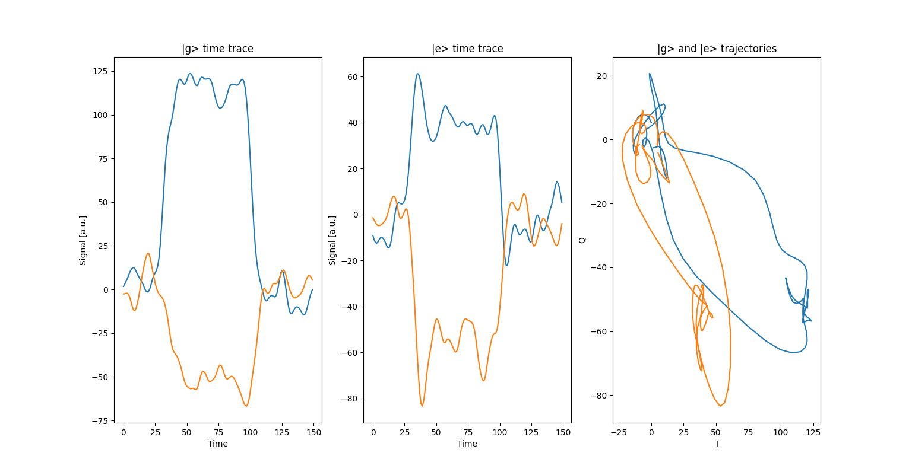

# Readout optimal integration weights

In the dispersive readout of a superconducting qubit, a microwave pulse is sent to the readout
resonator and the reflected or transmitted signal is captured and analyzed to infer the 
state of the qubit.

The steps to capture the state of the qubit are: (i) capture the analog signal coming out of the resonator,
(ii) demodulation of the analog signal, and (iii) the integration of the demodulated signal. 

The integration step can be done with a constant weights to all-time data points of the captured signal,
nevertheless, the signal coming out of the resonator is not constant and has time dynamics. Thus, non-constant
integration weights could be exploited to maximize the amount of information extracted from a readout operation.

The resonator coupled to a qubit has a time dynamic that is dependent on three parameters: 
the power, the dispersive shift $\chi$, and the loss $\kappa$.

The following figure shows the simulated I and Q trajectories of the ground and excited states as a function of time
and in the IQ-plane,

The optimal integration weights can be obtained by capturing the time traces shown above. The optimal integration
weights are the difference between the I and Q traces describing the ground and excited state dynamics.

This folder contains five different python files `StateDiscriminator.py`, `TimeDiffCalibrator.py`,
`TwoStateDiscriminator.py`, `configuration.py`, and `ge_discriminator_train_n_benchmark.py`