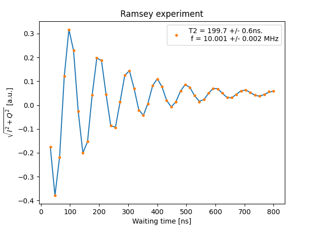

# Plot tools
This library includes tools to help to handle plots from QUA programs.

## interrupt_on_close
This function allows to interrupt the execution and free the console when closing the live-plotting figure.

### Usage example

```python
from qm.QuantumMachinesManager import QuantumMachinesManager
from qualang_tools.plot import interrupt_on_close
from qm.qua import *
import matplotlib.pyplot as plt
from configuration import config

with program() as test_prog:
    # The QUA program to execute
    ...

qmm = QuantumMachinesManager()
qm = qmm.open_qm(config)
job = qm.execute(test_prog)

fig = plt.figure()
interrupt_on_close(fig, job)

while job.result_handles.is_processing():
    # Live plotting
    ...
    # The execution will be cleanly interrupted by closing the figure
```

## plot_demodulated_data 1D and 2D
These functions plot the demodulated data (either 'I' and 'Q' or amplitude and phase) from a 1D or 2D scan.

### Usage example

```python
from qualang_tools.plot import plot_demodulated_data_1d, plot_demodulated_data_2d
import numpy as np

time = np.linspace(0,1000, 1001)
amp = np.linspace(-2, 2, 101)
I = np.array([[np.sin(i/100)*np.cos(k) for i in time] for k in amp])
Q = np.array([[np.cos(i/100)*np.sin(k) for i in time] for k in amp])

plot_demodulated_data_2d(time, amp, I, Q, "time [ns]", "amplitude [mV]", "2D map", amp_and_phase=True, plot_options={"cmap": "magma"})
```

## get_simulated_samples_by_element
This function gets the samples generated from the QUA simulator by element.

### Usage example

```python
from qm.QuantumMachinesManager import QuantumMachinesManager
from qm import SimulationConfig
from qm.qua import *
from configuration import config
from qualang_tools.plot import get_simulated_samples_by_element

with program() as test_prog:
    # The QUA program to simulate
    ...

qmm = QuantumMachinesManager()
simulation_config = SimulationConfig(duration=8000)
job = qmm.simulate(config, test_prog, simulation_config)
qubit_samples = get_simulated_samples_by_element("qubit", job, config)
resonator_samples = get_simulated_samples_by_element("resonator", job, config)
```


## plot_simulator_output
This function plots the samples generated from the QUA simulator by element using *plotly*.

### Usage example

```python
from qm.QuantumMachinesManager import QuantumMachinesManager
from qm import SimulationConfig
from qm.qua import *
from configuration import config
from qualang_tools.plot import plot_simulator_output

with program() as test_prog:
    # The QUA program to simulate
    ...

qmm = QuantumMachinesManager()
simulation_config = SimulationConfig(duration=8000)
job = qmm.simulate(config, test_prog, simulation_config)
# If plot_axes is provided (plot only the specified elements)
fig = plot_simulator_output(job, config, duration_ns=8000, plot_axes=[["RF"],["qubit"]])
fig.show()

# If plot_axes is not provided (plot all elements used in the qua program in their own axis)
fig = plot_simulator_output(job, config, duration_ns=8000, qua_program=test_prog)
fig.show()
```

## Fitting 
This tool makes the fitting process much easier! Once you have the data you can:

* Fit the data to a suitable fitting function.
* Plot the data as well as the fitting function.
* Extract physical parameters from the fitting.
* Save the fitting parameters to a json file.
* Open the json file and save its data to a python dictionary.

The current available fitting functions in the class are:

* Linear fitting.
* Fitting for extracting T1 parameter. 
* Fitting for the Ramsey experiment (when scanning the dephasing time).
* Fitting for the transmission amplitude of the resonantor spectroscopy.
* Fitting for the reflection amplitude of the resonantor spectroscopy.

More functions are added frequently. 

### Use
In order to use the fitting class, one should have `from fitting import *` in his/her code.
 
### Usage example
In the example below you can see five parts:
1. The measured data - This section simulates the data in order to show the relevant functions.
2. Fit - This section does the fit to the data.
3. Plot - This section plots the data and the fitting plot.
4. Save - This section saves the data to a json file. You are required to enter the file name, so the saved file will be of the form `data_fit_{file_name}.json` 
5. Read json - This section reads the json file and prints the saved parameters if the flag `print_params=True`.

```python
from qualang_tools.plot.fitting import Fit, Read

### Simulating the measured data ###
# taus and amplitude are the measured data
def ramsey_data(x, final_offset, T2, amp, initial_offset, f, phase):
    return  final_offset * (1 - np.exp(-x * (1/T2))) + amp / 2 * (
            np.exp(-x * (1/T2))
            * (initial_offset * 2 + np.cos(2 * np.pi * f * x + phase))
            )


tau_min = 32
tau_max = 800
dtau = 16
taus = np.arange(tau_min, tau_max + 0.1, dtau)
amplitude = ramsey_data(taus, final_offset=0.05, T2=200, amp=1, initial_offset=0, f=10e-3, phase=0) + np.random.normal(
                0, 0.001, len(taus))
### Fit ###
fit = Fit()
# Choose the suitable fitting function
file_name = 'Ramsey_experiment'
fit.ramsey(taus, amplitude, verbose=True, plot=True, save=file_name)
plt.title('Ramsey experiment')

### Read json file as dictionary ###
read = Read()
data = read.read_saved_params(file_id=file_name, verbose=True)


```

Below is the plot of this example

