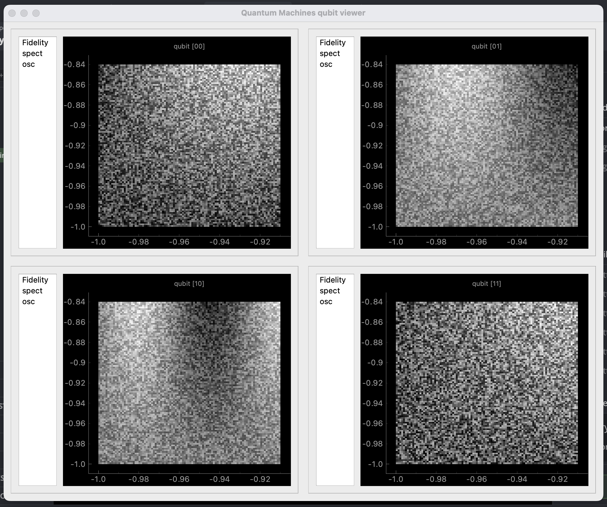

# GUI 

This package is for an interactive plotter for use with 
multiple qubit systems. The GUI is initialised with a tuple that 
sets up the size of the grid - typically you would use one cell per pixel, 
so the tuple represents the shape of the qubit grid. 

Using ```ipython=True``` as a flag means if the script in which you initialise the 
GUI is run through an ipython console (such as in pycharm), the plotter remains interactive
and does not block the python thread. 

The GUI is a grid with each cell representing data from a given qubit. Plots pertaining to each 
qubit can be stacked on top of each other, with 0d (text), 1d, and 2d plots available. 
You can then select which plot to display by selecting it from the list within the 
cell.

The following code demonstrates a simple example of how to use the GUI. The included example.py file 
may also be a helpful start. 

```python
from grid_gui import GUI 
import numpy as np 
# set up qubit grid shape
qubit_grid_shape = (4, 4)

# launch the gui
gui = GUI(qubit_grid_shape, ipython=True)

# the address for each gui element is a tuple (i, j), representing its position in the grid. 
# not every cell in the GUI needs data added to it, which may be the case if only some qubits 
# are being used for a given experiment. 
qubit_addresses = ((0, 0), (0, 1), (1, 0), (1, 1))

x_len = 100
y_len = 100
x = np.linspace(-1, 2, x_len)
y = np.linspace(-1, 3, y_len)

random_data = lambda: np.fromfunction(
    lambda i, j: np.sin(i / 8 * np.random.rand()) * j / 128, (x_len, y_len), dtype=float
) + np.random.rand(x_len, y_len)


# you have three options: 0d (text), 1d, and 2d.
# for 0d, just have the data item (text or digit)
# for 1d, you need to provide x and y data, both 1d array-like objects
# for 2d, you need to provide x and y data (1d array-like), and your 2d array-like data array

# the way to do it is to call gui.plot_xd(qubit_address (e.g. (0, 0), layer name, x, y....)

for qubit in qubit_addresses:
    gui.plot_0d(qubit, "Fidelity", f"{np.random.rand() * 100:.2f}%")
    gui.plot_1d(qubit, "spect", *fake_data())
    gui.plot_2d(qubit, "osc", x, y, random_data())


# if you like, you can update the data in a layer by gui.update_layer(qubit_address (i, j), layer_name, data)
```

To add a layer to cell (i, j), you can call one of three methods: 
```gui.plot_0d(address, name, string)```, ```gui.plot_1d(address, name, x, y)```,
or ```gui.plot_2d(address, name, x, y, z)```. This adds a layer called name to the plot widget in cell
address (address should be a tuple (i, j)), with the relevant data. For a 0d plot, you are plotting a value
that is converted to a string and displayed in the middle of the plot window. 



1D and 2D plots, when hovered over by the mouse, present crosshairs and display the x, y values 
under the mouse position. Double clicking the mouse puts the x, y coordinates in the console 
that the GUI is being run from. 