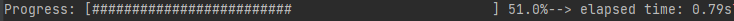

# Results tools
This library includes tools to help handling results from QUA programs.

## fetching_tool
The fetching tool has an API to easily fetch data from the stream processing.

First the results handle needs to be initiated by specifying the QM job and the list of data to be fetched. 
These values must correspond to results saved in the stream processing. A flag is also avalable with two options:
- `mode="wait_for_all"` will wait until all values were processed for all named results before fetching.
- `mode="live"` will fetch data one by one for all named results for live plotting purposes.

Then the results can be fetched with the `.fetch_all()` method while the program is processing, as shown in the code snippet below.

### Usage example
 
```python
from qualang_tools.results import fetching_tool

n_avg = 1000
with program as prog:
    # QUA program with n_avg averaging iterations

qmm = QuantumMachinesManager(host="127.0.0.1", port="80")
qm = qmm.open_qm(config)
job = qm.execute(prog)

my_results = fetching_tool(job, data_list=["I", "Q", "Ie", "Qe", "Ig", "Qg"], mode="live")

fig = plt.figure()

while my_results.is_processing():
    # Live plotting
    I, Q, Ie, Qe, Ig, Qg = my_results.fetch_all()
    ...
```

## progress_counter
This function displays a progress bar and prints the current progress percentage and remaining computation time.
Several flags are available to customize the progress bar:
- `progress_bar=True`: displays the progress bar if True.
- `percent=True`: displays the progress percentage if True.
- `start_time=None`: displays elapsed time from start if not None.




### Usage example

```python
from qualang_tools.results import fetching_tool, progress_counter

n_avg = 1000

with program as prog:
    # QUA program with n_avg averaging iterations

qmm = QuantumMachinesManager()
qm = qmm.open_qm(config)
job = qm.execute(prog)

my_results = fetching_tool(job, data_list=["iteration", "I", "Q", "Ie", "Qe", "Ig", "Qg"], mode="live")

fig = plt.figure()

while my_results.is_processing():
    # Live plotting
    iteration, I, Q, Ie, Qe, Ig, Qg = my_results.fetch_all()
    progress_counter(iteration, n_avg, start_time=my_results.get_start_time())
    ...
```
