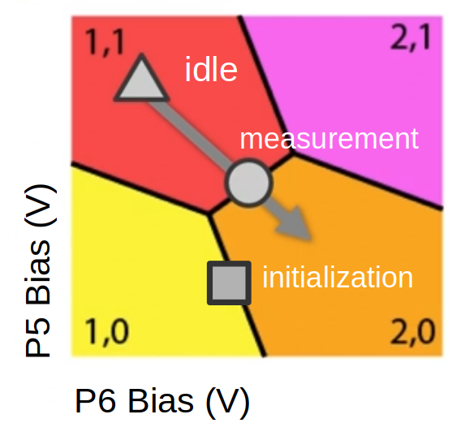
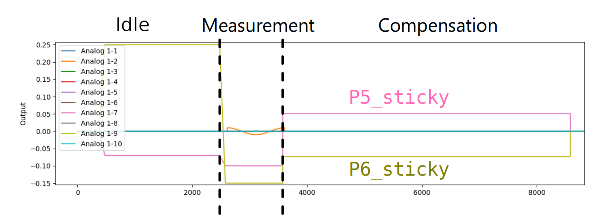

# VoltageGateSequence

The `VoltageGateSequence` class facilitates the creation and management of complex pulse sequences for quantum operations, allowing for dynamic voltage control, ramping, and compensation across multiple gate elements.

> **Note**: Make sure to initialize the class before opening the `qm`!

> **Note**: Make sure the check the timing of the pulses in simulation or use `strict_timing()` to avoid real-time gaps!

## Features

- **Dynamic Voltage Control**: Defines voltage levels (points) in gate-space and durations for multiple elements.
- **Step and Ramp Support**: Adds steps and ramps to the pulse sequence.
- **Compensation Pulse**: Keeps track of average voltage levels for compensation pulses.
- **Configuration Management**: Updates the provided configuration with necessary operations and waveforms for the sequence.

## Initialization

To use the `VoltageGateSequence` class, start by initializing it with the necessary configuration and elements.

```python
from voltage_gate_sequence import VoltageGateSequence

# Configuration dictionary for OPX
configuration = {
    "elements": {...},
    "pulses": {...},
    "waveforms": {...}
}

# List of elements involved in the gate operations
elements = ["P5_sticky", "P6_sticky"]

# Initialize the VoltageGateSequence
seq = VoltageGateSequence(configuration, elements)
```

## Methods

### `add_points`

Register a relevant voltage point. This function allows you to define and name specific voltage points in the charge stability map, which can be referenced later in the sequence. This corresponds to a meaningful location in charge space, such as those shown in the following image:


```python
def add_points(self, name: str, coordinates: list, duration: int) -> None:
```

- **name**: Name of the voltage point.
- **coordinates**: Voltage value of each gate element involved in the operation.
- **duration**: How long should the voltages be maintained at this level in ns. Must be larger than 16ns and a multiple of 4ns.

**Example Usage**:

```python
# Add a voltage point named "idle" with specific coordinates and duration
seq.add_points(name="idle", coordinates=[-0.07, 0.25], duration=2000)
seq.add_points(name="measurement", coordinates=[-0.13, 0.35], duration=1000)
seq.add_points(name="initialization", coordinates=[-0.10, 0.30], duration=1500)
```

In the example above:
- A voltage point named "idle" is added with specific voltage coordinates and a duration of 2000 nanoseconds.
- A voltage point named "measurement" is added with specific voltage coordinates and a duration of 1000 nanoseconds.
- A voltage point named "initialization" is added with specific voltage coordinates and a duration of 1500 nanoseconds.


### `add_step`

Add a voltage level to the pulse sequence. This function allows you to specify a voltage level and duration for each gate, with optional ramping to the desired level. The function also allows navigation between pre-defined voltage points.

```python
def add_step(
    self,
    level: list[Union[int, QuaExpression, QuaVariable]] = None,
    duration: Union[int, QuaExpression, QuaVariable] = None,
    voltage_point_name: str = None,
    ramp_duration: Union[int, QuaExpression, QuaVariable] = None
) -> None:
```

- **level** (float or QUA variable): Desired voltage level of the different gates composing the gate in Volts.
- **duration** (float or QUA variable): How long the voltage level should be maintained in ns. Must be a multiple of 4ns and larger than 16ns.
- **voltage_point_name**: Name of the voltage level if added to the list of relevant points in the charge stability map.
- **ramp_duration**: Duration in ns of the ramp if the voltage should be ramped to the desired level instead of stepped. Must be a multiple of 4ns and larger than 16ns.

**Example Usage**:

```python
# Define points in the charge stability map [V1, V2]
level_idle = [-0.07, 0.25]
duration_idle = 2000  # nanoseconds

# Add an idle step
seq.add_step(level=level_idle, duration=duration_idle)

# Add a step using a voltage point name and ramp duration
seq.add_step(voltage_point_name="idle", ramp_duration=200)
```

In the example above:
- The first call to `add_step` adds an idle step with a specified voltage level and duration.
- The second call adds a step using a predefined voltage point named "idle" with a specified ramp duration.

### `add_compensation_pulse`

Add a compensation pulse of the specified duration whose amplitude is derived from the previous operations. This ensures that the average voltage seen by the gates remains zero over time.

```python
def add_compensation_pulse(self, duration: int) -> None:
```

- **duration**: Duration of the compensation pulse in clock cycles (4ns). Must be larger than 4 clock cycles.

**Example Usage**:

```python
# Add a compensation pulse with a duration of 1000 ns
seq.add_compensation_pulse(duration=1000)
```

In the example above:
- A compensation pulse with a duration of 1000 nanoseconds is added to the sequence to balance the average voltage.

### `ramp_to_zero`

Ramp all the gate voltages down to zero Volt and reset the averaged voltage derived for defining the compensation pulse.

```python
def ramp_to_zero(self, duration: int = None):
```

- **duration**: How long will it take for the voltage to ramp down to 0V in clock cycles (4ns). If not provided, the default pulse duration defined in the configuration will be used.

**Example Usage**:

```python
# Ramp all gate voltages down to zero over 500 ns
seq.ramp_to_zero(duration=500)
```

In the example above:
- The `ramp_to_zero` function is used to ramp all gate voltages down to zero over a period of 500 nanoseconds.

## Example Program

Below is an example QUA program that demonstrates how to use the `VoltageGateSequence` class to find the Pauli Spin Blockade (PSB) region according to a specified protocol.

```python
from qm.qua import *
from qm.QuantumMachinesManager import QuantumMachinesManager
from qm import SimulationConfig
import numpy as np
import copy
import matplotlib.pyplot as plt

# Define voltage sequences
p5_voltages = np.linspace(-0.1, 0.1, 20)
p6_voltages = np.linspace(-0.15, 0.15, 20)

# Points in the charge stability map [V1, V2]
level_idle = [-0.07, 0.25]
duration_idle = 2000  # nanoseconds

# Local configuration
local_config = copy.deepcopy(configuration)

# Initialize VoltageGateSequence
seq = VoltageGateSequence(local_config, ["P5_sticky", "P6_sticky"])
seq.add_points("idle", level_idle, duration_idle)

# Number of shots
n_shots = 100

# Define the QUA program
with program() as PSB_search_prog:
    n = declare(int)  # QUA integer used as an index for the averaging loop
    n_st = declare_stream()  # Stream for the iteration number (progress bar)
    I = declare(fixed)
    Q = declare(fixed)
    I_st = declare_stream()
    Q_st = declare_stream()
    x = declare(fixed)
    y = declare(fixed)

    with for_(n, 0, n < n_shots, n + 1):
        save(n, n_st)
        with for_each_((x, y), (p5_voltages.tolist(), p6_voltages.tolist())):
            # Play fast pulse
            seq.add_step(voltage_point_name="idle", ramp_duration=200)
            seq.add_step(duration=1000, level=[x, y], ramp_duration=200)
            seq.add_compensation_pulse(duration=1000)

            # do some measurement on the dot after manipulation
            # ...

            align()

            # Ramp the voltage down to zero at the end of the triangle (needed with sticky elements)
            seq.ramp_to_zero(duration=500)

            align()

            # Wait at each iteration in order to ensure that the data will not be transferred faster than 1 sample per µs to the stream processing.
            wait(1_000 * u.ns)  # in ns
```
### Plot
Here is the first iteration of the program:

