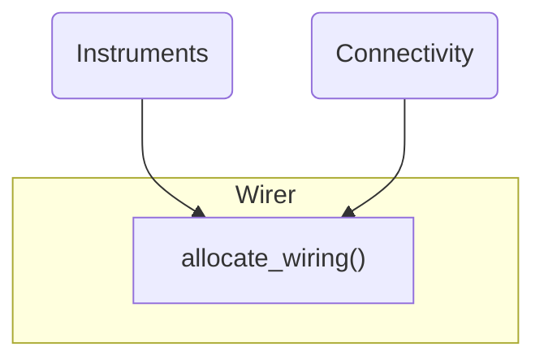

# Table of Contents
1. [Description](#description)
2. [Overview](#overview)
3. [Features](#features)
4. [Usage](#usage)
    1. [Instruments](#instruments)
        1. [Common Setups](#common-setups)
        2. [Disjoint Setups](#common-setups)
    2. [Connectivity](#connectivity)
    3. [Allocation](#allocation)
    3. [Visualization](#visualization)

# Description
The `wirer` module provides a way to auto-assignin channels for a collection of Quantum elements given a specific QM instrument setup.

# Overview
The module decouples two parts of a quantum computing setup:
 - `Instruments`: Defines all accesssible Quantum Machines instruments.
 - `Connectivity`: Defines all functional quantum elements to be controlled by Quantum Machines instruments.

Once fully defined, the quantum elements can be mapped to channels on the Quantum Machines instruments using the `allocate_wiring` function:

Resulting in something like this:


# Features
The wirer tool supports the following features:
 - Assignment of channels to any combination of MW-FEM, LF-FEM, Octave or OPX+.
 - Any mapping of N resonator lines to M qubits.
 - Any mapping of N FEMs to OPX1000 chassis slots.
 - Constrained-scope allocation according to user preferences.
 - Natural overflowing during assignment to multiple slots, chassis, modules, octaves, etc.
 - Any combination of resonator, flux line, coupler line for each qubit.
 - Total visualization of the final connectivity.

# Usage
## Instruments
Start with an empty instruments container:
```python
from qualang_tools.wirer import Instruments

instruments = Instruments()
```
Using the "builder" pattern, you are able to define and add instruments to the container, line-by-line. 

### Common Setups
Below are examples of some instrument setups:
```python
# Single OPX+
instruments.add_opx_plus(con=1)
```
```python
# Single OPX+ and Octave
instruments.add_opx_plus(controllers=1)
instruments.add_octave(indices=1)
```
<details>
<summary>Image</summary>


</details>

```python
# Multiple OPXs and Octaves
instruments.add_opx_plus(controllers=[1, 2])
instruments.add_octave(indices=[1, 2])
```
```python
# Single LF-FEM and Octave
instruments.add_lf_fem(controller=1, slots=[1])
instruments.add_octave(indices=1)
```
```python
# Single LF-FEM and MW-FEM
instruments.add_lf_fem(controller=1, slots=[1])
instruments.add_mw_fem(controller=1, slots=[2])
```
<details>
<summary>Image</summary>

</details>

```python
# Multiple LF-FEMs and MW-FEMs
instruments.add_lf_fem(controller=1, slots=[1,2,3,4,5])
instruments.add_mw_fem(controller=1, slots=[6,7,8])
```

### Disjoint Setups
The instruments container allows you to construct a "disjoint" setup, that is one where the indices are not logically ordered or belong only partially to a full cluster:
```python
# Disjoint OPX+ and Octave addressing
instruments.add_opx_plus(controllers=[2, 5])
instruments.add_octave(indices=[1, 3, 8])
```
```python
# Disjoint OPX+ and Octave addressing
instruments.add_opx_plus(controllers=[2, 5])
instruments.add_octave(indices=[1, 3, 8])
```

## Connectivity

## Allocation

## Visualization
