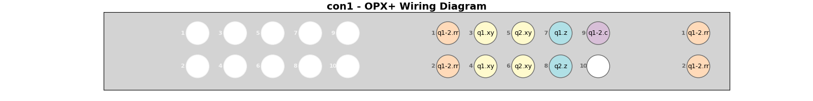

# Table of Contents
1. [Description](#description)
2. [Overview](#overview)
3. [Features](#features)
4. [Example](#example)
5. [Usage](#usage)
    1. [Instruments](#instruments)
        1. [Common Setups](#common-setups)
        2. [Disjoint Setups](#common-setups)
    2. [Connectivity](#connectivity)
        1. [Basic Elements (Superconducting Qubits)](#basic-elements-superconducting-qubits)
        2. [How to add digital triggers](#how-to-add-digital-triggers)
        3. [How to constrain where channels will be allocated](#how-to-constrain-where-channels-will-be-allocated)
    3. [Allocation](#allocation)
        1. [Basic Allocation](#allocating-channels)
        2. [Re-using Channels](#make-certain-channels-re-usable)
    4. [Visualization](#visualization)

# Description
The `wirer` module provides a way to auto-assigning channels for a collection of Quantum elements given a specific QM instrument setup.

# Overview
The module decouples two parts of a quantum computing setup:
 - `Instruments`: Defines all accesssible Quantum Machines instruments.
 - `Connectivity`: Defines all functional quantum elements to be controlled by Quantum Machines instruments.

Once fully defined, the quantum elements can be mapped to channels on the Quantum Machines instruments using the `allocate_wiring` function:


# Features
The wirer tool supports the following features:
 - Assignment of channels to any combination of MW-FEM, LF-FEM, Octave or OPX+.
 - Any mapping of N resonator lines to M qubits.
 - Any mapping of N FEMs to OPX1000 chassis slots.
 - Constrained-scope allocation according to user preferences.
 - Natural overflowing during assignment to multiple slots, chassis, modules, octaves, etc.
 - Any combination of resonator, drive line, flux line, coupler line for each qubit.
 - Total visualization of the final connectivity.

# Example
```python
from qualang_tools.wirer import Instruments, Connectivity, allocate_wiring, visualize, lf_fem_spec

# Define instruments
instruments = Instruments()
instruments.add_lf_fem(controller=1, slots=[1, 2])
instruments.add_mw_fem(controller=1, slots=[3, 7])

qubits = [1, 2, 3, 4, 5, 6]
qubit_pairs = [(1, 2), (2, 3), (3, 4), (4, 5), (5, 6)]

# Define quantum elements
connectivity = Connectivity()
connectivity.add_resonator_line(qubits=qubits, triggered=True)
connectivity.add_qubit_drive_lines(qubits=qubits, triggered=True)
connectivity.add_qubit_flux_lines(qubits=qubits)
connectivity.add_qubit_pair_flux_lines(qubit_pairs=qubit_pairs, constraints=lf_fem_spec(out_slot=2))

# Allocate channels for each quantum element
allocate_wiring(connectivity, instruments)

# Visualize the result
visualize(connectivity.elements, instruments.available_channels)
```


# Usage
## Instruments
Start with an empty instruments container:
```python
from qualang_tools.wirer import Instruments

instruments = Instruments()
```
Using the "builder" pattern, you are able to define and add instruments to the container, line-by-line. 

### Common Setups
Below are examples of some instrument setups:
```python
# Single OPX+
instruments.add_opx_plus(con=1)
```
```python
# Single OPX+ and Octave
instruments.add_opx_plus(controllers=1)
instruments.add_octave(indices=1)
```
<details>
<summary>Image</summary>


</details>

```python
# Multiple OPXs and Octaves
instruments.add_opx_plus(controllers=[1, 2])
instruments.add_octave(indices=[1, 2])
```
```python
# Single LF-FEM and Octave
instruments.add_lf_fem(controller=1, slots=[1])
instruments.add_octave(indices=1)
```
```python
# Single LF-FEM and MW-FEM
instruments.add_lf_fem(controller=1, slots=[1])
instruments.add_mw_fem(controller=1, slots=[2])
```
<details>
<summary>Image</summary>

</details>

```python
# Multiple LF-FEMs and MW-FEMs
instruments.add_lf_fem(controller=1, slots=[1,2,3,4,5])
instruments.add_mw_fem(controller=1, slots=[6,7,8])
```

### Disjoint Setups
The instruments container allows you to construct a "disjoint" setup, that is one where the indices are not logically ordered or belong only partially to a full cluster:
```python
# Disjoint OPX+ and Octave addressing
instruments.add_opx_plus(controllers=[2, 5])
instruments.add_octave(indices=[1, 3, 8])
```
```python
# Disjoint OPX+ and Octave addressing
instruments.add_lf_fem(controller=3, slots=[2, 4])
instruments.add_mw_fem(controller=3, slots=[1, 7])
```

## Connectivity
The `Connectivity` class is like a blueprint for what quantum elements exist in our system, along with some optional 
information about how channels should be allocated for these elements. 

To define your own `Connectivity` object, start with an empty container:
```python
from qualang_tools.wirer import Connectivity

connectivity = Connectivity()
```
### Basic Elements (Superconducting Qubits)
Now you can add "wiring specifications" to the container. These indicate what channels you need for a particular type 
of quantum functionality. 

**Note**: Channels aren't being allocated at this stage- instead, we are adding "templates" for channels which will be allocated later.
```python
# Define arbitrary set of qubits and qubit pairs for convenience
qubits = [1, 2, 5]
qubit_pairs = [(1, 2)]

# Define a single resonator feedline for multiple qubits
connectivity.add_resonator_line(qubits=qubits)

# Define a RF drive-lines for controlling multiple qubits
connectivity.add_qubit_drive_lines(qubits=qubits)

# Define DC lines for controlling flux
connectivity.add_qubit_flux_lines(qubits=qubits)

# Define DC lines for controlling tunable coupler
connectivity.add_qubit_pair_flux_lines(qubit_pairs=qubits)
```
<details>
<summary>Example on OPX+ and Octave</summary>


</details>

### How to define digital triggers
```python
connectivity.add_resonator_line(qubits=qubits, triggered=True)
```
### How to constrain where channels will be allocated
In order to be more specific about the connectivity, we can add `constraints`. First, you need to select which 
type of constraint you will apply, based on the instruments you wish the line to be allocated. The types you can
choose from include:
```python
from qualang_tools.wirer import (
    mw_fem_spec,
    lf_fem_spec, 
    lf_fem_iq_spec,
    lf_fem_iq_octave_spec,
    opx_spec, 
    opx_iq_spec, 
    opx_iq_octave_spec,
    octave_spec
)
```
Then, you can set almost **any combination** of the available attributes according to what you want constrained. Here are some 
examples of how you could constrain something to a particular set of I/Q channels between an OPX+ and an Octave.
```python
# Must allocate to OPX con1
constraint = opx_iq_octave_spec(con=1)
```
```python
# Must allocate to OPX con2
constraint = opx_iq_octave_spec(con=2)
```
```python
# Must allocate to Octave RF3
constraint = opx_iq_octave_spec(rf_out=3)
```
```python
# Must allocate to OPX con1, I/Q channels 7 & 8, Octave RF3
constraint = opx_iq_octave_spec(con=1, out_port_i=7, out_port_q=8, rf_out=3)
```
After defining some `constraint`, you can apply it to a wiring specification:
```python
connectivity.add_qubit_drive_lines(qubits=[1], constraints=constraint)
```

## Allocation
### Allocating channels
Once you have defined suitable `Instruments` and `Connectivity` objects, you can allocate channels using the
`allocate_wiring` function:
```python
from qualang_tools.wirer import allocate_wiring

allocate_wiring(connectivity, instruments)
```
At the time of allocation, all of the channel information is put inside the `connectivity.elements` dictionary.

### Make certain channels re-usable
In order to double-up allocations to channels, you can keep them "free for allocation" even after doing a round of 
allocation. Here's an example of how you could allocate multiple qubits to the same channel, either if you don't
have enough channels to measure every element, or if you'd like to multiplex the outputs:
```python
connectivity = Connectivity()

connectivity.add_qubit_drive_lines(qubits=1)
allocate_wiring(connectivity, instruments, block_used_channels=False)

connectivity.add_qubit_drive_lines(qubits=2)
allocate_wiring(connectivity, instruments)

connectivity.add_qubit_drive_lines(qubits=3)
allocate_wiring(connectivity, instruments, block_used_channels=False)

connectivity.add_qubit_drive_lines(qubits=4)
allocate_wiring(connectivity, instruments)
```
<details>
<summary>Image</summary>


</details>

## Visualization
To visualize an allocated `connectivity` object, you can pass it into the visualization function:
```python
visualize(connectivity.elements, available_channels=instruments.available_channels)
```
**Note**: Passing `instruments.available_channels` is optional, but it makes the plotting nicer by plotting white
space on un-allocated channels!